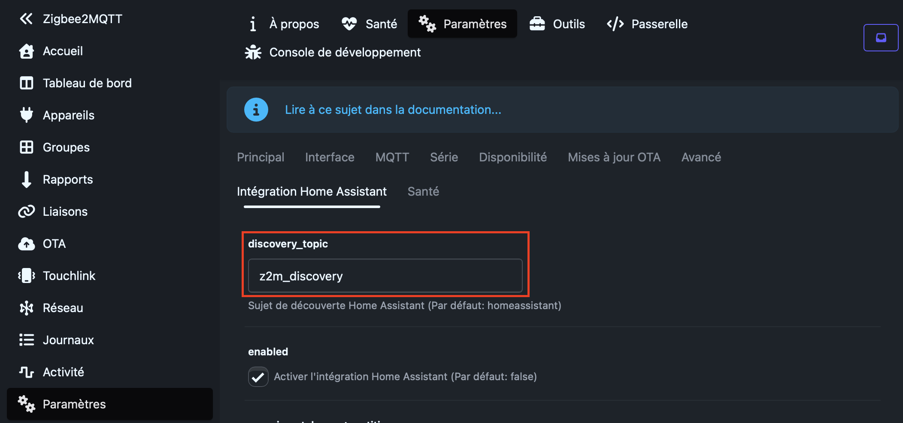

# Z2M Discovery Translator Add-on Repository

Home Assistant add-on repository for **Z2M Discovery Translator**.

The add-on listens to Zigbee2MQTT Home Assistant MQTT Discovery payloads on a source prefix, translates known entity names, then republishes the translated payloads to Home Assistant's MQTT Discovery prefix.

## Why

Zigbee2MQTT exposes some device-specific entities with English labels, for example `Smart temperature control`, `Child lock`, or `Valve opening degree`. Home Assistant can translate generic device classes, but these Zigbee2MQTT-specific labels are published as explicit names through MQTT Discovery.

This add-on keeps Zigbee2MQTT untouched and translates discovery payloads before Home Assistant consumes them.

## Translations (community)

All labels are in JSON files under **`z2m-discovery-translator/translations/`** (`fr.json`, `de.json`, `es.json`). In the add-on options, **language** is a dropdown (**fr**, **de**, **es**). You do **not** need to edit Python to add or fix entries: open a PR that only changes the relevant `*.json` file (to add another language, also extend the `language` list in `config.yaml`).

## Known limitations

- **Entity registry:** Home Assistant may keep **old entity names** already stored in the entity registry, even after discovery payloads change.
- **Existing devices:** You may need an **MQTT discovery refresh** or **removing the MQTT device / entities** in Home Assistant so names update; **Zigbee re-pairing is not required**.
- **Scope:** Only the explicit **`name`** field in MQTT discovery payloads is rewritten. Other keys (topics, `device`, `unique_id`, etc.) are left unchanged.

## Install from GitHub

1. In Home Assistant, go to **Settings → Add-ons → Add-on store**.
2. Open **⋮ → Repositories**.
3. Add this repository URL.
4. Install **Z2M Discovery Translator**.

## Required Zigbee2MQTT configuration

The add-on listens to `z2m_discovery/#` and republishes to `homeassistant/#` by default. Zigbee2MQTT must publish discovery under that topic instead of the default `homeassistant`.

### Via the Zigbee2MQTT web UI

1. Open **Zigbee2MQTT** in the browser.
2. Go to **Settings** (sidebar) — in a French UI this is **Paramètres**.
3. In the top tabs, stay on **Settings** / **Paramètres**, then open the **Home Assistant integration** tab (**Intégration Home Assistant** in French).
4. Enable **Home Assistant integration** if it is not already (**Activer l'intégration Home Assistant**).
5. Set **discovery_topic** to `z2m_discovery` (the default is `homeassistant` — *Sujet de découverte Home Assistant*).



If your build does not expose **status_topic** in the UI, set it in `configuration.yaml` as below (recommended anyway so the value matches Home Assistant’s expectations).

### Via `configuration.yaml`

```yaml
homeassistant:
  enabled: true
  discovery_topic: z2m_discovery
  status_topic: homeassistant/status
```

## Test

In Home Assistant, listen to:

```text
homeassistant/+/+/config
```

After restarting Zigbee2MQTT, translated names should appear in MQTT discovery payloads.
